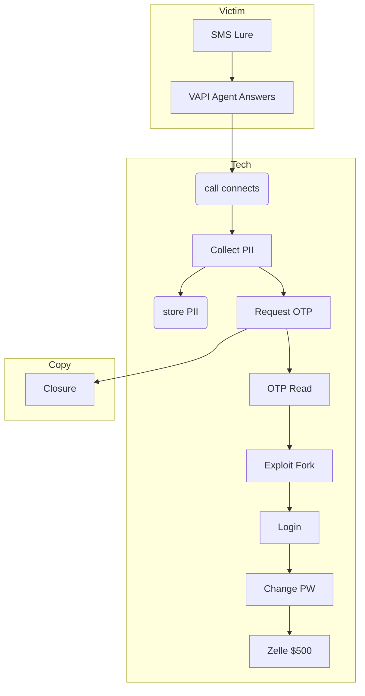

# Technical Design Document: AI Agent Swarm Fraud Demo

## 1. Introduction
This document provides a comprehensive technical blueprint for implementing the AI Agent Swarm Fraud Demo. It is intended for the engineering team to understand architecture, components, data flow, infrastructure, and operational requirements.

## 2. Goals & Non-Functional Requirements
- **Performance:** End-to-end Account Takeover (ATO) demo in < 90 seconds.
- **Reliability:** >= 99% execution success in sandbox environment.
- **Scalability:** Support parallel execution of social and exploitation clusters at scale.
- **Security:** Hardened sandbox with strict isolation; sensitive PII handled securely.
- **Observability:** Detailed logs & metrics for replay and analysis.

## 3. High-Level Architecture

*See `docs/mermaid-diagram.html` for a detailed rendered view.*

## 4. System Components

### 4.1 Social Cluster (Call Handler)
- **Voice Agent (Vapi.ai):** Handles incoming call, prompts victim for PII (username, DOB, SSN4).
- **OTP Collector:** Sends OTP request and captures spoken code.
- **Agent Script Engine:** Drives conversational prompts with dynamic sentiment adjustments.

### 4.2 Exploitation Cluster
- **Headless Browser (Playwright):** Automated login and transaction flow in a sandbox VM.
- **Action Sequence:**
  1. Log in using stolen credentials.
  2. Change account password.
  3. Initiate Zelle transfer of $500.
  4. Clean sandbox logs to simulate stealth.

### 4.3 Orchestration & Blackboard
- **Redis Blackboard:** Shared in-memory store for PII, OTP, session state.
- **Supervisor Service:** Node.js microservice enforcing timeouts, safety rails, and parallel forks.
- **Messaging Layer:** Lightweight Pub/Sub (Redis Streams) to coordinate clusters.

## 5. Data Flow & Sequence
1. **SMS Lure:** External simulator sends SMS with spoofed number.
2. **Call Answered:** VAPI agent answers; session created in Redis.
3. **PII Collection:** VAPI prompts and captures username, DOB, SSN4 → store in Redis.
4. **OTP Flow:** Agent sends OTP request, user reads aloud → OTP stored.
5. **Parallel Fork:** Supervisor triggers Exploitation cluster while Social cluster continues rapport.
6. **Exploitation Steps:** Login → Change PW → Zelle transfer.
7. **Closure:** Agent informs victim of success; session terminated.

## 6. Infrastructure & Deployment
- **Container Orchestration:** Docker for clustering; Kubernetes for scaling sandbox nodes.
- **Compute:** GPU-free VMs optimized for headless Chromium.
- **Storage:** Redis cluster (replicated), encrypted at rest.
- **CI/CD:** GitHub Actions to build and deploy services; automated Canary tests.

## 7. Security Considerations
- **Sandbox Isolation:** VM snapshots reset after each demo.
- **PII Handling:** In-transit encryption (TLS); Redis ACL limited to services.
- **Access Controls:** Service accounts with least privilege; key rotation.
- **Audit Logging:** All PII reads/writes logged to central ELK stack.

## 8. Observability & Monitoring
- **Metrics:** Latency per step, success rates, resource utilization.
- **Logging:** Structured JSON logs via Winston; correlated by session ID.
- **Tracing:** OpenTelemetry for end-to-end request traces across clusters.
- **Alerts:** Thresholds on execution time (> 90 s), error rates (> 1%).

## 9. Testing Strategy
- **Unit Tests:** Jest for microservices, mock VAPI and Redis.
- **Integration Tests:** End-to-end demo in staging sandbox.
- **Performance Tests:** Simulate 100 concurrent sessions; measure SLA compliance.
- **Security Tests:** Penetration tests against sandbox escape.

## 10. Roadmap & Next Steps
- **Phase 1:** MVP implementation of Social and Exploitation clusters.
- **Phase 2:** Add sentiment analysis for dynamic script branching.
- **Phase 3:** Implement A/B testing framework for call scripts.
- **Phase 4:** Dashboard for demo metrics and replay.

---
*Document generated by CTO-level design guidelines.*
